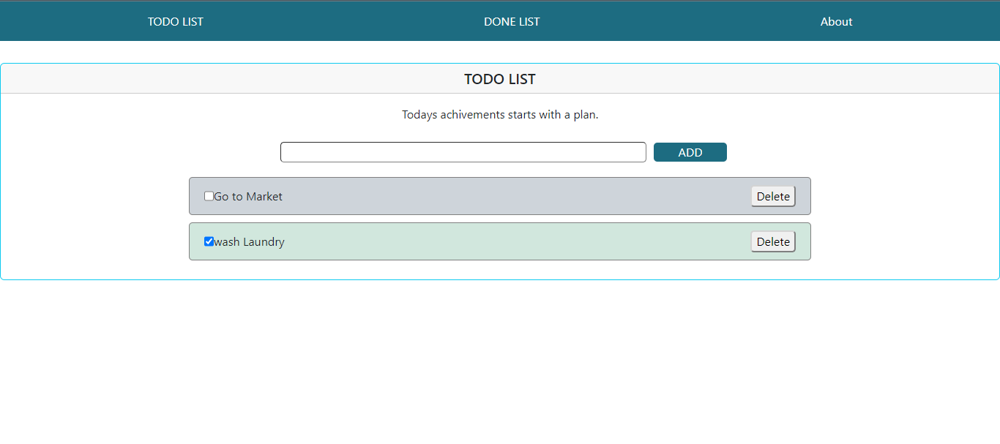
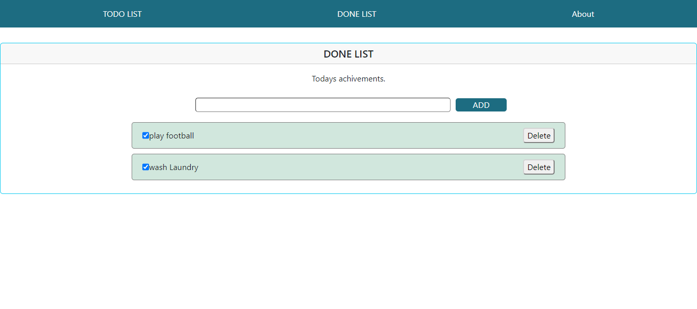

# TODO LIST & DONE LIST

The app is 2 in 1, a normal todo list app where anyone can add there plan segments as todos, and the second part is the done list for people who add saving the universe or travelling to mars as tasks and then get overwhelmed before doing anything so a done list is a better obtion for them.

The app has 3 main pages:
- TODO LIST page
- DONE LIST page
- About page

## Application usage

- A todo list: 
    - user can add as many tasks as they want
    - they can check completeing the tasks or uncheck them resambling of undoing them with visual responsces: the checked checkbox and the green bg
    - user can delete any task
    - if user wants to check all the done tasks, they can just navigate to the DONE LIST page.
- A done list:
    - user can add as many done tasks as they want with the checkbox checked and green bg
    - user can toggle the checkbox resambling of undoing the task with visual responsces of undone task: the unchecked check box and the light grey bg
    - the unchecked task is gonna still be viewed as part of the done list, so the user will have the options of still wanting this task to be done or delete it as long as they are still in the DONE LIST page, but if they navigated to any other place in the app the undone tasks will be just moved to the TODO LIST page 
    - you can delete any task
    - all undone tasks can be still viewed in the TODO LIST page 

## Built with

**Tech used:** 
- React
- Redux
- React-Redux
- react-router-dom
- uuid
- react-bootstrap
- bootstrap

## Screenshots

## Author

- [@Gehad A. Gamal](https://github.com/gehad33)

